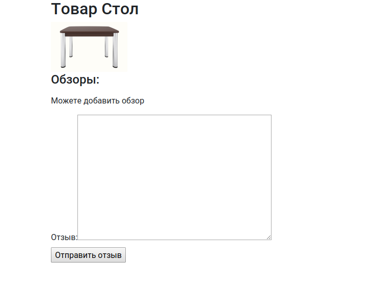

# Обзор товаров. Формы (добавление данных на сайт)

## Задание

Прототип сайта, с обратной связью от пользователя.

Необходимо:
1) Дописать необходимое во `product_view` карточки товара. 
В этой `view` реализовать вывод всех оставленные отзывы на товар и окно ввода отзыва.
Для ввода отзыва использовать форму `ReviewForm`.

2) Разрешать пользователю добавлять только один отзыв на товар.
Добавить проверку, есть ли уже обзор этого товара от этого пользователя.

## Реализация

Отображение информации о товаре и отзывов можно доверить `product_view`.
Для отображения формы, её нужно передать в контекст `render`-функции

Добавление и сохранение информации на сервер осуществляется через POST запрос.
Соответственно нужно дописать в функцию `def product_view(self, request, *args, **kwargs):` логику для обработки POST-запроса.
В ней проверять есть ли отзыв или нет.

Обратите внимание, вам необходимо разделять в функции GET и POST логику. Более продвинутым способом является использование class based view для этого (https://docs.djangoproject.com/en/2.2/topics/class-based-views/intro/), но это не является обязательным условием и можно рассматривать как дополнительное задание.

Было бы хорошо не показывать форму для отзыва, если отзыв оставить уже нельзя.

Так как на сайте нет авторизации, то можно хранить информацию о том был ли отзыв, сохраняя информацию в сессию на сервере.
Сессия хранит данные отдельно для каждого пользователя. С ней можно работать как со словарем. 
В Django можно получить доступ через объект `request`, который передается в некоторые функции `view` `request.session`.

Например, можно хранить id продуктов на которые есть отзыв:
`request.session['reviewed_products'] = [1,2,3,4]`

### Как это может выглядеть

"# Review" 
